# Kubernetes Auto-Scaling Web Application

A comprehensive 3-tier web application demonstrating Kubernetes horizontal pod autoscaling (HPA) with React frontend, Go backend, PostgreSQL database, and Redis cache.

## Architecture

### System Overview

```mermaid
graph TB
    subgraph "Kubernetes Cluster"
        subgraph "Frontend (2 pods)"
            F1[nginx + React<br/>Port 80]
            F2[nginx + React<br/>Port 80]
        end
        
        subgraph "Backend (2-10 pods)"
            B1[Go API<br/>Port 8080]
            B2[Go API<br/>Port 8080]
            B3[Go API<br/>Port 8080]
            BN[... up to 10 pods]
        end
        
        subgraph "Data Layer"
            DB[(PostgreSQL<br/>Port 5432)]
            CACHE[(Redis Cache<br/>Port 6379)]
        end
        
        subgraph "Auto-scaling"
            HPA[HPA Controller<br/>CPU/Memory based]
            METRICS[Metrics Server]
        end
    end
    
    USER[👤 User] --> F1
    USER --> F2
    F1 --> B1
    F1 --> B2
    F2 --> B1
    F2 --> B2
    B1 --> DB
    B2 --> DB
    B3 --> DB
    B1 --> CACHE
    B2 --> CACHE
    B3 --> CACHE
    
    HPA --> B1
    HPA --> B2
    HPA --> B3
    METRICS --> HPA
    
    style F1 fill:#61dafb
    style F2 fill:#61dafb
    style B1 fill:#00add8
    style B2 fill:#00add8
    style B3 fill:#00add8
    style DB fill:#336791
    style CACHE fill:#dc382d
    style HPA fill:#ff6b6b
```



## Features

- **Auto-scaling**: Backend pods scale from 2 to 10 based on CPU/memory usage
- **Health Monitoring**: Comprehensive health checks and monitoring
- **Caching**: Redis integration for improved performance
- **Load Testing**: Built-in stress testing endpoints to trigger HPA
- **Development Tools**: Complete Taskfile.yaml for all operations

## Quick Start

### Prerequisites

- Docker Desktop
- kubectl
- kind (Kubernetes in Docker)
- task (optional, for using Taskfile commands)

### 1. Setup Cluster and Deploy

```mermaid
flowchart LR
    A[🚀 Start] --> B{Docker Running?}
    B -->|No| C[Start Docker Desktop]
    B -->|Yes| D[Create kind cluster]
    C --> D
    D --> E[Load Docker images]
    E --> F[Deploy PostgreSQL]
    F --> G[Deploy Redis]
    G --> H[Deploy Backend]
    H --> I[Deploy Frontend]
    I --> J[Setup HPA]
    J --> K[Configure Ingress]
    K --> L[✅ Ready!]
    
    style A fill:#4CAF50
    style L fill:#4CAF50
    style C fill:#FFC107
    style B fill:#2196F3
```



```bash
# Using Task (recommended)
task setup

# Or using scripts directly
./scripts/deploy.sh
```

### 2. Access the Application

```mermaid
flowchart LR
    subgraph LocalMachine["Local Machine"]
        BROWSER["🌐 Browser"]
        HOSTS["/etc/hosts<br/>webapp.local to 127.0.0.1"]
    end
    
    subgraph KindCluster["Kind Cluster"]
        NGINX["nginx-ingress<br/>:80"]
        FS["frontend-service<br/>:80"]
        BS["backend-service<br/>:8080"]
        FP["Frontend Pods<br/>nginx + React"]
        BP["Backend Pods<br/>Go API"]
    end
    
    BROWSER --> HOSTS
    HOSTS --> NGINX
    NGINX --> FS
    FS --> FP
    FP -->|"/api/*"| BS
    BS --> BP
    
    style BROWSER fill:#61dafb
    style NGINX fill:#4CAF50
    style FP fill:#61dafb
    style BP fill:#00add8
```



Add to `/etc/hosts`:
```
127.0.0.1 webapp.local
```

Then access: http://webapp.local

**Alternative**: Use port-forwarding for direct access:
```bash
kubectl port-forward -n webapp svc/frontend-service 3001:80
# Access: http://localhost:3001
```

### 3. Test Auto-scaling

```bash
# Monitor HPA
kubectl get hpa -n webapp -w

# Run load test
task test:load-intensive

# Watch pods scale up
kubectl get pods -n webapp -w
```

## Development Commands

This project uses [Task](https://taskfile.dev/) for development workflows:

```bash
# Show all available commands
task

# Build and deploy everything
task setup

# Development modes
task dev:backend           # Go backend (standard net/http)
task dev:frontend          # React development server

# Monitor resources
task status:all
task top:pods

# Port forward services
task port:backend
task port:frontend

# View logs
task logs:backend
task logs:frontend

# Load testing
task test:stress
task test:load

# Restart deployments
task restart:backend
task restart:frontend

# Cleanup
task clean:all
task clean:cluster
```

## Directory Structure

```
kubernetes-autoscale-webapp/
├── frontend/                 # React application
│   ├── Dockerfile
│   ├── package.json
│   ├── nginx.conf
│   └── src/
├── backend/                  # Go API server
│   ├── config/              # Configuration management
│   ├── handlers/            # HTTP handlers (health, user, stress)
│   ├── models/              # Data structures
│   ├── Dockerfile           # Container build
│   ├── go.mod               # Go modules
│   ├── go.sum               # Dependency checksums
│   └── main.go              # Application entry point (stdlib net/http)
├── k8s/                     # Kubernetes manifests
│   ├── namespace.yaml
│   ├── configmaps/
│   ├── secrets/
│   ├── backend/
│   ├── frontend/
│   ├── database/
│   ├── redis/
│   └── ingress/
├── scripts/                 # Deployment scripts
│   ├── deploy.sh
│   ├── load-test.sh
│   ├── cleanup.sh
│   ├── sustained-load.sh
│   └── intensive-load.sh
├── Taskfile.yaml           # Development commands
└── README.md
```

## Backend Architecture

### Request Flow


The backend is implemented in **Go 1.24** using:

### 🏗️ **Clean Architecture**
- **config/**: Environment-based configuration management
- **handlers/**: HTTP handlers organized by domain (health, user, stress)
- **models/**: Data structures and request/response types
- **main.go**: Application entry point with dependency injection

### 🚀 **Standard Library HTTP**
- Uses Go 1.24+ built-in HTTP routing (no external dependencies)
- Modern pattern matching: `GET /api/users/{id}`
- Path parameters via `r.PathValue("id")`
- CORS middleware implementation
- Structured logging and error handling

## API Endpoints

### Backend API

- `GET /health` - Health check with database/Redis status
- `GET /api/users` - List all users (cached)
- `POST /api/users` - Create new user
- `GET /api/users/{id}` - Get user by ID (cached)
- `GET /api/stress` - CPU-intensive endpoint for load testing

### Frontend Features

- User creation form
- User list display
- Load testing button
- Real-time status updates

## Monitoring and Scaling

### Auto-scaling Timeline


### HPA Configuration

- **Min Replicas**: 2
- **Max Replicas**: 10
- **CPU Target**: 50% of requests
- **Memory Target**: 70% of requests
- **Scale Up**: 50% increase every 30s (max 2 pods/60s)
- **Scale Down**: 10% decrease every 60s

### Monitoring Commands

```bash
# Watch HPA status
kubectl get hpa -n webapp -w

# Check resource usage
kubectl top pods -n webapp

# View scaling events
kubectl describe hpa backend-hpa -n webapp

# Monitor pod count
kubectl get pods -n webapp -w
```

## Load Testing

### Built-in Tests

```bash
# Single stress test
task test:stress

# Sustained load (20 concurrent)
task test:load

# Intensive load (50 concurrent)
task test:load-intensive
```

### Manual Testing

```bash
# Test user creation
curl -X POST -H "Content-Type: application/json" \
  -d '{"name":"John Doe","email":"john@example.com"}' \
  http://localhost:8080/api/users

# Trigger CPU load
curl http://localhost:8080/api/stress
```

## Configuration

### Environment Variables

Backend configuration via ConfigMap and Secrets:

- `DB_HOST`: PostgreSQL host
- `DB_PORT`: PostgreSQL port
- `DB_NAME`: Database name
- `DB_USER`: Database username (from secret)
- `DB_PASSWORD`: Database password (from secret)
- `REDIS_HOST`: Redis host

### Resource Limits

```yaml
Backend:
  requests: { memory: 128Mi, cpu: 100m }
  limits: { memory: 256Mi, cpu: 200m }

Frontend:
  requests: { memory: 64Mi, cpu: 50m }
  limits: { memory: 128Mi, cpu: 100m }
```

## Troubleshooting

### Common Issues

1. **Metrics Server Not Working**
   ```bash
   kubectl patch deployment metrics-server -n kube-system --type='json' \
     -p='[{"op": "add", "path": "/spec/template/spec/containers/0/args/-", "value": "--kubelet-insecure-tls"}]'
   ```

2. **Pods Not Scaling**
   - Check metrics server: `kubectl top pods -n webapp`
   - Verify HPA: `kubectl describe hpa backend-hpa -n webapp`
   - Ensure resource requests are set

3. **Database Connection Issues**
   - Restart backend: `task restart:backend`
   - Check postgres logs: `task logs:postgres`

4. **Port Forwarding Issues**
   ```bash
   pkill -f "kubectl port-forward"
   task port:backend
   ```

### Useful Debugging Commands

```bash
# Check all resources
task status:all

# View detailed pod info
kubectl describe pods -n webapp

# Check events
kubectl get events -n webapp --sort-by='.lastTimestamp'

# Test connectivity
kubectl exec -it -n webapp deployment/backend -- wget -qO- http://postgres-service:5432
```

## Advanced Features

### Custom Metrics

The HPA can be extended with custom metrics:

```yaml
metrics:
  - type: Pods
    pods:
      metric:
        name: http_requests_per_second
      target:
        type: AverageValue
        averageValue: "1k"
```

### Multi-cluster Deployment

For production, consider:

- External database (RDS, Cloud SQL)
- Redis Cluster mode
- External load balancer
- SSL/TLS termination
- Monitoring with Prometheus/Grafana

## Performance Testing Results

Typical scaling behavior:

- **Scale Up**: ~30-60 seconds after load increase
- **Scale Down**: ~60-120 seconds after load decrease
- **Maximum Throughput**: ~1000 requests/second per pod
- **Database Connections**: Pooled, max 100 per pod

## Contributing

1. Fork the repository
2. Create feature branch
3. Test locally with `task setup`
4. Submit pull request

## License

MIT License - see LICENSE file for details
