# Building a Production-Ready Auto-Scaling Web Application with Kubernetes

*A comprehensive guide to creating a 3-tier application that automatically scales with demand*

---

Have you ever wondered how modern applications handle sudden traffic spikes without breaking a sweat? Today, I'll walk you through building a complete auto-scaling web application using Kubernetes, Go, React, and some really cool automation. By the end of this guide, you'll have a production-ready system that automatically spins up new server instances when traffic increases and scales back down when things quiet down.

## What We're Building

We're creating a modern 3-tier web application that demonstrates the power of Kubernetes Horizontal Pod Autoscaling (HPA). Here's what makes this special:

- **Frontend**: React application served by nginx with intelligent API proxying
- **Backend**: Go API server using the latest HTTP routing features (Go 1.24+)
- **Database Layer**: PostgreSQL for data persistence and Redis for high-performance caching
- **Auto-scaling**: Kubernetes HPA that automatically adjusts based on CPU and memory usage
- **Load Testing**: Built-in stress testing to see auto-scaling in action

```mermaid
graph TB
    subgraph "Kubernetes Cluster"
        subgraph "Frontend (2 pods)"
            F1[nginx + React<br/>Port 80]
            F2[nginx + React<br/>Port 80]
        end
        
        subgraph "Backend (2-10 pods)"
            B1[Go API<br/>Port 8080]
            B2[Go API<br/>Port 8080]
            B3[Go API<br/>Port 8080]
            BN[... up to 10 pods]
        end
        
        subgraph "Data Layer"
            DB[(PostgreSQL<br/>Port 5432)]
            CACHE[(Redis Cache<br/>Port 6379)]
        end
        
        subgraph "Auto-scaling"
            HPA[HPA Controller<br/>CPU/Memory based]
            METRICS[Metrics Server]
        end
    end
    
    USER[👤 User] --> F1
    USER --> F2
    F1 --> B1
    F1 --> B2
    F2 --> B1
    F2 --> B2
    B1 --> DB
    B2 --> DB
    B3 --> DB
    B1 --> CACHE
    B2 --> CACHE
    B3 --> CACHE
    
    HPA --> B1
    HPA --> B2
    HPA --> B3
    METRICS --> HPA
    
    style F1 fill:#61dafb
    style F2 fill:#61dafb
    style B1 fill:#00add8
    style B2 fill:#00add8
    style B3 fill:#00add8
    style DB fill:#336791
    style CACHE fill:#dc382d
    style HPA fill:#ff6b6b
```



## Chapter 1: Setting Up the Development Environment

Before we dive into the code, let's get our development environment ready. We'll need:

- **Docker Desktop**: For containerization
- **kubectl**: Kubernetes command-line tool
- **kind**: Kubernetes in Docker (perfect for local development)
- **task**: Task runner for automation (optional but highly recommended)

### Creating Our Project Structure

Let's start by creating a well-organized project structure:

```bash
mkdir kubernetes-autoscale-webapp
cd kubernetes-autoscale-webapp

# Create our main directories
mkdir -p {backend,frontend,k8s,scripts}
mkdir -p k8s/{backend,frontend,database,redis,ingress,configmaps,secrets}
mkdir -p backend/{config,handlers,models}
mkdir -p frontend/src/{components,services}
```

This structure keeps everything organized and makes it easy to navigate as our project grows.

## Chapter 2: Building the Go Backend

The heart of our application is a modern Go API server. I chose Go 1.24 specifically because it includes fantastic new HTTP routing features that eliminate the need for external router libraries.

### Creating the Main Application

Let's start with our `backend/main.go`:

```go
package main

import (
	"context"
	"database/sql"
	"log"
	"net/http"

	"k8s-autoscale-webapp/config"
	"k8s-autoscale-webapp/handlers"

	"github.com/go-redis/redis/v8"
	_ "github.com/lib/pq"
)

func main() {
	// Load configuration
	cfg := config.Load()
	ctx := context.Background()

	// Initialize database
	db, err := initDB(cfg.DatabaseConfig)
	if err != nil {
		log.Fatal("Failed to initialize database:", err)
	}
	defer db.Close()

	// Initialize Redis
	rdb, err := initRedis(cfg.RedisConfig, ctx)
	if err != nil {
		log.Printf("Redis connection failed: %v", err)
	} else {
		log.Println("Redis connected successfully")
		defer rdb.Close()
	}

	// Initialize handlers
	healthHandler := handlers.NewHealthHandler(db, rdb, ctx)
	userHandler := handlers.NewUserHandler(db, rdb, ctx)
	stressHandler := handlers.NewStressHandler()

	// Create a new ServeMux
	mux := http.NewServeMux()

	// Health check endpoint
	mux.Handle("GET /health", healthHandler)
	mux.Handle("GET /api/health", healthHandler)

	// User endpoints using Go 1.22+ pattern matching
	mux.HandleFunc("GET /api/users", userHandler.GetUsers)
	mux.HandleFunc("POST /api/users", userHandler.CreateUser)
	mux.HandleFunc("GET /api/users/{id}", userHandler.GetUser)

	// Stress test endpoint
	mux.Handle("GET /api/stress", stressHandler)

	// Wrap with CORS middleware
	handler := handlers.CORSMiddleware(mux)

	log.Printf("Server starting on port %s...", cfg.ServerConfig.Port)
	log.Fatal(http.ListenAndServe(":"+cfg.ServerConfig.Port, handler))
}
```

Notice how clean this is! The new Go 1.24 HTTP routing lets us write `GET /api/users/{id}` directly in the router registration. No more external dependencies for basic routing.

### Configuration Management

Smart configuration is crucial for a cloud-native application. Here's our `backend/config/config.go`:

```go
package config

import (
	"fmt"
	"os"
)

type Config struct {
	DatabaseConfig DatabaseConfig
	RedisConfig    RedisConfig
	ServerConfig   ServerConfig
}

type DatabaseConfig struct {
	Host     string
	Port     string
	User     string
	Password string
	DBName   string
}

func Load() *Config {
	return &Config{
		DatabaseConfig: DatabaseConfig{
			Host:     getEnv("DB_HOST", "localhost"),
			Port:     getEnv("DB_PORT", "5432"),
			User:     getEnv("DB_USER", "postgres"),
			Password: getEnv("DB_PASSWORD", ""),
			DBName:   getEnv("DB_NAME", "webapp"),
		},
		RedisConfig: RedisConfig{
			Host:     getEnv("REDIS_HOST", "localhost"),
			Port:     getEnv("REDIS_PORT", "6379"),
			Password: getEnv("REDIS_PASSWORD", ""),
			DB:       0,
		},
		ServerConfig: ServerConfig{
			Port: getEnv("SERVER_PORT", "8080"),
		},
	}
}

func getEnv(key, defaultValue string) string {
	if value := os.Getenv(key); value != "" {
		return value
	}
	return defaultValue
}
```

This configuration system works seamlessly in both development (with defaults) and production (with environment variables).

### The Secret Sauce: Stress Testing Handler

Here's where it gets interesting. To demonstrate auto-scaling, we need a way to generate CPU load. Our `backend/handlers/stress.go` does exactly that:

```go
package handlers

import (
	"encoding/json"
	"net/http"

	"k8s-autoscale-webapp/models"
)

type StressHandler struct{}

func NewStressHandler() *StressHandler {
	return &StressHandler{}
}

func (h *StressHandler) ServeHTTP(w http.ResponseWriter, r *http.Request) {
	// CPU intensive operation for testing HPA
	iterations := 100000000
	result := 0
	for i := 0; i < iterations; i++ {
		result += i
	}

	response := models.StressTestResponse{
		Message:    "Stress test completed",
		Result:     result,
		Iterations: iterations,
	}

	w.Header().Set("Content-Type", "application/json")
	json.NewEncoder(w).Encode(response)
}
```

This endpoint deliberately consumes CPU cycles, which will trigger our auto-scaling mechanism. In a real application, you might see similar patterns during image processing, data analysis, or other CPU-intensive tasks.

### Smart Caching with Redis

Our user handler demonstrates intelligent caching patterns:

```go
func (h *UserHandler) GetUsers(w http.ResponseWriter, r *http.Request) {
	w.Header().Set("Content-Type", "application/json")

	cacheKey := "users:all"
	cachedUsers, err := h.RDB.Get(h.Ctx, cacheKey).Result()
	if err == nil {
		w.Write([]byte(cachedUsers))
		return
	}

	// Cache miss - fetch from database
	rows, err := h.DB.Query("SELECT id, name, email, created_at FROM users ORDER BY created_at DESC")
	// ... database query logic ...

	usersJSON, _ := json.Marshal(users)
	h.RDB.Set(h.Ctx, cacheKey, usersJSON, 5*time.Minute)

	json.NewEncoder(w).Encode(users)
}
```

This pattern reduces database load and improves response times - crucial for a scalable application.

## Chapter 3: Building the React Frontend

Our frontend is intentionally simple but demonstrates all the key concepts. Here's our `frontend/src/App.js`:

```javascript
import React, { useState, useEffect } from 'react'
import axios from 'axios'

// Smart API URL detection for different environments
const API_URL = process.env.REACT_APP_API_URL || 
  (window.location.hostname === 'localhost' && window.location.port === '3000' ? 'http://localhost:8080' : '')

function App() {
  const [users, setUsers] = useState([])
  const [newUser, setNewUser] = useState({ name: '', email: '' })
  const [loading, setLoading] = useState(false)
  const [stressTestResult, setStressTestResult] = useState('')

  const runStressTest = async () => {
    setLoading(true)
    setStressTestResult('Running stress test...')
    try {
      const response = await axios.get(`${API_URL}/api/stress`)
      setStressTestResult(
        'Stress test completed: ' + JSON.stringify(response.data)
      )
    } catch (error) {
      setStressTestResult('Stress test failed: ' + error.message)
    }
    setLoading(false)
  }

  return (
    <div className='App'>
      <h1>Kubernetes Auto-Scaling Demo</h1>
      
      <div className='section'>
        <h2>Load Testing</h2>
        <button onClick={runStressTest} disabled={loading}>
          {loading ? 'Running...' : 'Run Stress Test'}
        </button>
        {stressTestResult && <p>{stressTestResult}</p>}
      </div>
    </div>
  )
}
```

### The Magic of nginx Proxying

Our frontend uses a clever nginx configuration that handles both serving the React app and proxying API calls:

```nginx
server {
    listen 80;
    server_name localhost;
    root /usr/share/nginx/html;
    
    location / {
        try_files $uri $uri/ /index.html;
    }

    location /api/ {
        proxy_pass http://backend-service:8080;
        proxy_set_header Host $host;
        proxy_set_header X-Real-IP $remote_addr;
        proxy_set_header X-Forwarded-For $proxy_add_x_forwarded_for;
        proxy_set_header X-Forwarded-Proto $scheme;
    }
}
```

This configuration means users can access everything through a single URL, while nginx intelligently routes API calls to our backend service.

## Chapter 4: Containerization Strategy

Our Dockerfiles are optimized for both development speed and production efficiency.

### Backend Dockerfile

```dockerfile
FROM golang:1.24-alpine AS builder
WORKDIR /app
COPY go.mod go.sum ./
RUN go mod download
COPY . .
RUN CGO_ENABLED=0 GOOS=linux go build -o main .

FROM alpine:latest
RUN apk --no-cache add ca-certificates
WORKDIR /root/
COPY --from=builder /app/main .
EXPOSE 8080
CMD ["./main"]
```

### Frontend Dockerfile

```dockerfile
FROM node:18-alpine AS builder
WORKDIR /app
COPY package*.json ./
RUN npm install
COPY . .
RUN npm run build

FROM nginx:alpine
COPY --from=builder /app/build /usr/share/nginx/html
COPY nginx.conf /etc/nginx/conf.d/default.conf
EXPOSE 80
CMD ["nginx", "-g", "daemon off;"]
```

Both use multi-stage builds to keep the final images small and secure.

## Chapter 5: Kubernetes Orchestration

Now comes the exciting part - deploying to Kubernetes with auto-scaling capabilities!

### The Heart of Auto-scaling: HPA Configuration

This is where the magic happens. Our `k8s/backend/hpa.yaml`:

```yaml
apiVersion: autoscaling/v2
kind: HorizontalPodAutoscaler
metadata:
  name: backend-hpa
  namespace: webapp
spec:
  scaleTargetRef:
    apiVersion: apps/v1
    kind: Deployment
    name: backend
  minReplicas: 2
  maxReplicas: 10
  metrics:
    - type: Resource
      resource:
        name: cpu
        target:
          type: Utilization
          averageUtilization: 50
    - type: Resource
      resource:
        name: memory
        target:
          type: Utilization
          averageUtilization: 70
  behavior:
    scaleDown:
      stabilizationWindowSeconds: 60
      policies:
        - type: Percent
          value: 10
          periodSeconds: 60
    scaleUp:
      stabilizationWindowSeconds: 30
      policies:
        - type: Percent
          value: 50
          periodSeconds: 30
```

This configuration tells Kubernetes:
- Keep at least 2 backend pods running (for availability)
- Scale up to a maximum of 10 pods
- Scale up when CPU hits 50% or memory hits 70%
- Be conservative when scaling down (60s wait, 10% reduction)
- Be more aggressive when scaling up (30s wait, 50% increase)

### Backend Deployment with Resource Limits

The crucial part for HPA to work is setting resource requests:

```yaml
apiVersion: apps/v1
kind: Deployment
metadata:
  name: backend
  namespace: webapp
spec:
  replicas: 2
  template:
    spec:
      containers:
        - name: backend
          image: backend:latest
          resources:
            requests:
              memory: '128Mi'
              cpu: '100m'      # 0.1 CPU cores
            limits:
              memory: '256Mi'
              cpu: '200m'      # 0.2 CPU cores
          readinessProbe:
            httpGet:
              path: /health
              port: 8080
            initialDelaySeconds: 10
            periodSeconds: 5
```

The resource requests are critical - HPA uses these to calculate CPU/memory percentages.

## Chapter 6: The Auto-scaling Architecture

Here's how the auto-scaling system works behind the scenes:


### The Scaling Decision Algorithm

The HPA uses this formula to determine the desired number of replicas:

```
desiredReplicas = ceil[currentReplicas * (currentMetricValue / desiredMetricValue)]
```

**Example Calculation:**
- Current pods: 2
- Current CPU: 80%
- Target CPU: 50%
- Desired pods: ceil[2 * (80/50)] = ceil[3.2] = **4 pods**

## Chapter 7: Automation with Taskfile

Managing all these components manually would be tedious. That's where our `Taskfile.yaml` shines:

```yaml
version: '3'

vars:
  CLUSTER_NAME: webapp-cluster
  NAMESPACE: webapp

tasks:
  setup:
    desc: Complete setup from scratch
    cmds:
      - task: cluster:create
      - task: deploy:all

  cluster:create:
    desc: Create kind cluster
    cmds:
      - kind create cluster --name {{.CLUSTER_NAME}}
      - kubectl apply -f https://raw.githubusercontent.com/kubernetes/ingress-nginx/main/deploy/static/provider/kind/deploy.yaml
      - kubectl wait --namespace ingress-nginx --for=condition=ready pod --selector=app.kubernetes.io/component=controller --timeout=120s

  deploy:all:
    desc: Full deployment pipeline
    deps: [build:all, load:all]
    cmds:
      - task: deploy:namespace
      - task: deploy:metrics-server
      - task: deploy:config
      - task: deploy:database
      - task: deploy:redis
      - task: deploy:backend
      - task: deploy:frontend
      - task: deploy:ingress

  test:load-intensive:
    desc: Run intensive load test
    cmd: ./scripts/intensive-load.sh
```

With this setup, getting everything running is as simple as:

```bash
task setup
```

## Chapter 8: Deployment and Testing

### The Complete Deployment Flow

```mermaid
flowchart LR
    A[🚀 Start] --> B{Docker Running?}
    B -->|No| C[Start Docker Desktop]
    B -->|Yes| D[Create kind cluster]
    C --> D
    D --> E[Load Docker images]
    E --> F[Deploy PostgreSQL]
    F --> G[Deploy Redis]
    G --> H[Deploy Backend]
    H --> I[Deploy Frontend]
    I --> J[Setup HPA]
    J --> K[Configure Ingress]
    K --> L[✅ Ready!]
    
    style A fill:#4CAF50
    style L fill:#4CAF50
    style C fill:#FFC107
    style B fill:#2196F3
```



### Setting Up the Environment

```bash
# Clone the repository
git clone <your-repo-url>
cd kubernetes-autoscale-webapp

# Start everything
task setup

# Add to /etc/hosts
echo "127.0.0.1 webapp.local" | sudo tee -a /etc/hosts

# Access the application
open http://webapp.local
```

### Testing Auto-scaling in Action

Now for the fun part - watching auto-scaling work:

```bash
# In terminal 1: Monitor HPA
kubectl get hpa -n webapp -w

# In terminal 2: Watch pods scale
kubectl get pods -n webapp -w

# In terminal 3: Generate load
task test:load-intensive
```

You'll see something like this:

```
NAME          REFERENCE            TARGETS   MINPODS   MAXPODS   REPLICAS   AGE
backend-hpa   Deployment/backend   15%/50%   2         10        2          1m

# After load test starts...
backend-hpa   Deployment/backend   85%/50%   2         10        2          2m
backend-hpa   Deployment/backend   85%/50%   2         10        4          2m
backend-hpa   Deployment/backend   45%/50%   2         10        4          3m
```

## Chapter 9: Production Considerations

### Monitoring and Observability

For production, you'll want to add:

```bash
# Resource monitoring
kubectl top pods -n webapp
kubectl top nodes

# Scaling events
kubectl describe hpa backend-hpa -n webapp

# Application logs
kubectl logs -n webapp -l app=backend -f
```

### Performance Tuning

Based on testing, typical scaling behavior:

- **Scale Up**: ~30-60 seconds after load increase
- **Scale Down**: ~60-120 seconds after load decrease  
- **Maximum Throughput**: ~1000 requests/second per pod
- **Database Connections**: Pooled, max 100 per pod

### Advanced HPA Features

You can extend the HPA with custom metrics:

```yaml
metrics:
  - type: Pods
    pods:
      metric:
        name: http_requests_per_second
      target:
        type: AverageValue
        averageValue: "1k"
```

## Chapter 10: What We've Accomplished

We've built a complete, production-ready auto-scaling web application that demonstrates:

✅ **Modern Go API** with the latest HTTP routing features  
✅ **React Frontend** with intelligent API proxying  
✅ **Kubernetes Auto-scaling** that actually works  
✅ **Complete CI/CD Pipeline** with one-command deployment  
✅ **Production-ready** monitoring and health checks  
✅ **Load Testing** to validate scaling behavior  

### The Real Magic

The beauty of this setup is that it handles traffic spikes automatically. Whether you're dealing with:

- **Marketing campaigns** that drive sudden traffic
- **Viral content** that overwhelms your servers
- **Peak usage hours** during the day
- **Seasonal traffic** during holidays

Your application will automatically scale up to handle the load and scale back down to save resources.

### Next Steps

Want to take this further? Consider:

1. **Custom Metrics**: Scale based on queue length, request latency, or business metrics
2. **Vertical Pod Autoscaling**: Automatically adjust CPU/memory requests
3. **Cluster Autoscaling**: Automatically add/remove nodes
4. **Multi-cluster Deployment**: Deploy across multiple regions
5. **Service Mesh**: Add Istio for advanced traffic management

## Conclusion

Building auto-scaling applications doesn't have to be complex. With the right architecture, clear separation of concerns, and solid automation, you can create systems that are both powerful and maintainable.

The combination of Go's performance, React's user experience, and Kubernetes' orchestration creates a platform that can grow with your business. And the best part? Everything we've built here uses modern, production-tested technologies that you can confidently deploy to production.

Remember: the goal isn't just to build something that works today, but something that will scale elegantly as your user base grows. This architecture gives you exactly that foundation.

---

*Ready to see auto-scaling in action? Clone the repository and run `task setup` to get started. Watch your pods scale up and down as you generate load - it's pretty magical the first time you see it work!*

**Repository**: [kubernetes-autoscale-webapp](https://github.com/your-username/kubernetes-autoscale-webapp)

**Tags**: #kubernetes #golang #react #autoscaling #docker #devops #cloudnative